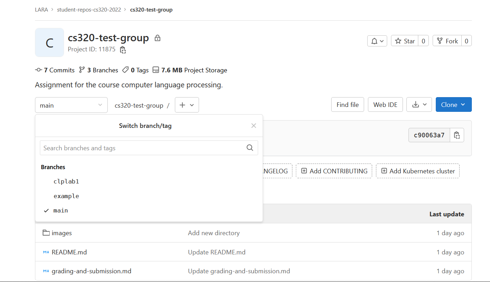

# CS-320 Assignments

Welcome! This git repository contains your assignments for the *Computer Language Processing* course.

Course material and administrative details can be found on the [Gitlab page](https://gitlab.epfl.ch/lara/cs320). More information on grading, Git and Gitlab can be found in [“Grading and Submission”](https://gitlab.epfl.ch/lara/cs320-template/-/blob/main/grading-and-submission.md).

## How to see files for a specific assignment

To select a branch, click on the "main" dropdown menu (under the project description):

