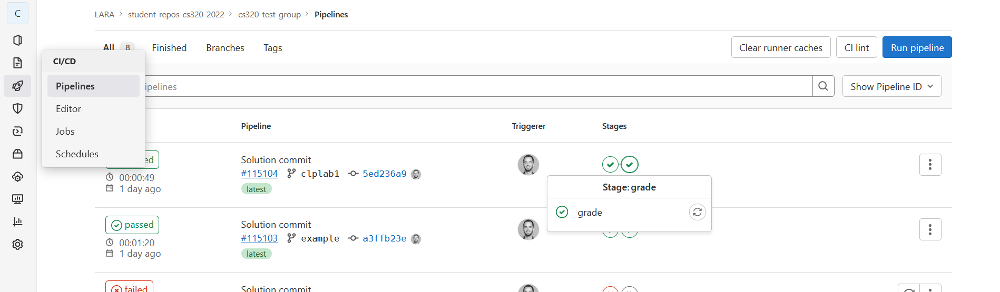
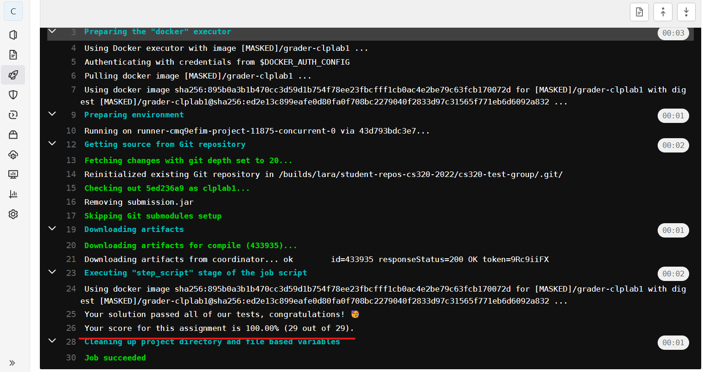

# Grading and submission

## Local tests and grading

Each lab is shipped with two sets of tests:

* The tests defined under `src/test/scala`, these are usually incomplete: we strongly encourage you to write additional tests to exercise every aspect of your code. You can run these tests from `sbt` using the following command:

  ```shell
  test
  ```

* The *grading tests*, that we use to grade your labs, these are provided as a "black box": you can run them but are not allowed to see their content, to encourage you to write your own tests. You can run them from `sbt` using the following command:

  ```shell
  Grading/test
  ```

  Your grade is determined by the number of these tests that pass, see the next section to see how to actually get a grade.

**Note:** remember that you can always put `~` before an sbt command to automatically re-run it when you save a file.

## Committing and pushing your code

**You need to push your code to gitlab before the deadline for the lab to
receive a grade. If you forget, your grade will be zero.**

If you've read the first few chapters of [Git
book](https://git-scm.com/book/en/v2) as recommended, you must already be
familiar with committing and pushing, but let's go over the basics once again:

At any point while working on an lab, you can see what changes you
haven't committed by writing:
```shell
git status
```

**Note:** If you get the error `Not a valid command: git`, it means you're inside sbt, you can't run git from sbt itself, you need to open another terminal in the same directory.

This will display the list of files you have modified since the last commit, to
see the exact changes you made, run:
```shell
git diff
```

To save these changes in a commit, run the following command (replace `"My message"` by a message
describing the changes since the last commit—see [How to Write a Git Commit
Message](https://chris.beams.io/posts/git-commit/) for some tips on writing
good commit messages):

```shell
git commit -am "My message"
```

It's good practice to commit your code regularly to document your changes.

You can then synchronize your local git repository with the gitlab server by
first running:

```shell
 git pull --no-rebase
```

This will merge in your local repository any change we made to the lab (we only change labs to fix critical bugs found after they have been released, so most of the time this will not do anything).

Finally, you can push your changes to gitlab:

```shell
git push
```

**Note:** that there are also graphical user interfaces to interact with git. For
example, have a look [Github Desktop](https://desktop.github.com). VS Code also has [built-in git
support](https://code.visualstudio.com/docs/editor/versioncontrol#_git-support).

## Checking the result

Once you've pushed your code, you can see the result online by going to `https://gitlab.epfl.ch/lamp/student-repos-cs320-2022/cs320-GASPAR/pipelines`.


The grading pipeline contains two steps:

* *compile*: your code does not compile for grading if the job fail.
* *grade*: the job results in a warning if you do not get the maximum grade (100.00%).

If a job is marked "pending", it means there are other students running jobs at
the same time and you'll have to wait a bit for your job to run.

You can click on the `grade` job to see its output:



Your grade is given on the line that starts with `Your score for this assignment is`:




**If you push to gitlab multiple times, your final grade will be based on the
last commit you pushed before the deadline.**
Footer
